## Cluster Tree — Parent → Child (IS_PART_OF)

This Mermaid diagram shows the IS_PART_OF parent→child cluster relationships discovered in the repository.

Paste this block into any Markdown file that supports Mermaid (GitHub, GitLab, MkDocs with Mermaid plugin).

```mermaid
flowchart TB
  %% Top-level parents (single top → second level as in sketch)
  Reformations["Reformations"]
  European_Reformations["European Reformations"]
  Christian_Tradition["Christian Tradition"]
  Interreligious_Exchange["Interreligious Exchange"]
  Hebrew_Tradition_root["Hebrew Tradition (root)"]

  %% Children / second tier under Reformations
  Reformations --> European_Reformations["European Reformations"]
  Reformations --> Christian_Tradition["Christian Tradition"]
  Reformations --> Interreligious_Exchange["Interreligious Exchange"]
  Reformations --> Hebrew_Tradition_root["Hebrew Tradition (root)"]
  European_Reformations --> English_Reformation["English Reformation"]
  European_Reformations --> German_Reformation["German Reformation"]
  European_Reformations --> Swiss_Reformation["Swiss Reformation"]
  European_Reformations --> French_Reformation["French Reformation"]
  European_Reformations --> Dutch_Reformation["Dutch Reformation"]
  European_Reformations --> Scottish_Reformation["Scottish Reformation"]
  European_Reformations --> Scandinavian_Reformations["Scandinavian Reformations"]
  European_Reformations --> Polish_Lithuanian_Reformation["Polish‑Lithuanian Reformation"]
  European_Reformations --> Bohemian_Moravian_Reformation["Bohemian/Moravian Reformation"]
  European_Reformations --> Catholic_Reformation["Catholic Reformation"]
  European_Reformations --> Radical_Reformation["Radical Reformation"]

  %% Subcluster under German_Reformation
  German_Reformation --> Luther_95_Theses_and_Aftermath_1517_1525["Luther — 95 Theses & Aftermath (1517–1525)"]

  %% Other top-level parents
  Christian_Tradition --> Early_Christianity["Early Christianity"]
  Interreligious_Exchange --> Jewish_Islamic_Exchange["Jewish–Islamic Intellectual Exchange"]
  Hebrew_Tradition_root --> Hebrew_Tradition_child["Hebrew Tradition"]

  %% Notes
  classDef parent fill:#f2f7ff,stroke:#2b6cb0;
  classDef child  fill:#f8f9fa,stroke:#2d3748;
  class European_Reformations,Christian_Tradition,Interreligious_Exchange,Hebrew_Tradition_root parent;
  class English_Reformation,German_Reformation,Swiss_Reformation,French_Reformation,Dutch_Reformation,Scottish_Reformation,Scandinavian_Reformations,Polish_Lithuanian_Reformation,Bohemian_Moravian_Reformation,Catholic_Reformation,Radical_Reformation,Early_Christianity,Jewish_Islamic_Exchange,Hebrew_Tradition_child child;

```

Notes:
- Some clusters (e.g., `Reformations`, `slugs_from_history`) are not attached as children to any `IS_PART_OF` parent and therefore appear as independent roots in the repository; consider attaching them if you want a single tree.
- `Hebrew_Tradition` contains a self-parent entry in the JSON; the diagram represents that as a root → child pair to avoid a self-loop.

If you want this committed to `docs/` instead, or exported as a PNG/SVG, tell me and I'll produce it.
